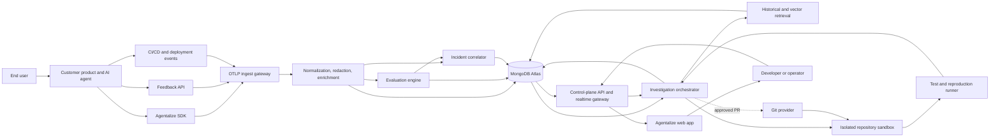
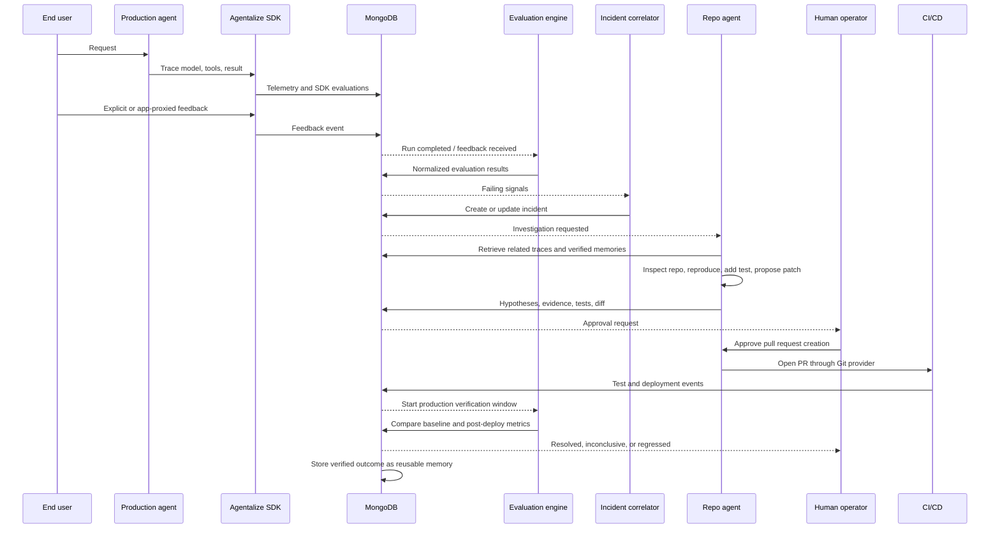
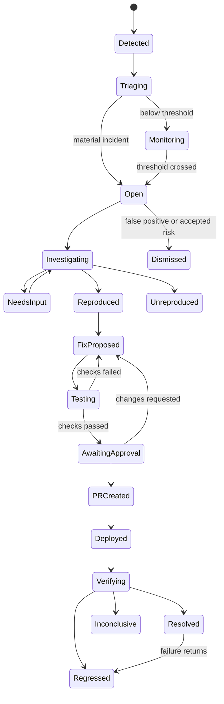

# Agentalize Architecture and Frontend Product Specification

Status: Planning baseline  
Audience: Product, frontend, backend, AI-agent, platform, and security engineers  
Product type: Desktop-first web application with a production SDK and repository-aware remediation agent

## 1. Product definition

Agentalize is a continuous improvement control plane for production AI agents.

It connects five things that are usually separated:

1. Production telemetry from the Agentalize SDK.
2. Automated evaluations that judge correctness, quality, safety, cost, and completion.
3. Direct and indirect user feedback.
4. Persistent incident and remediation memory in MongoDB.
5. A repository-aware engineering agent that diagnoses, reproduces, tests, and proposes fixes.

The product promise is:

> Detect what went wrong in production, explain why with evidence, use previous incidents as memory, create and test a safe fix, and verify whether production improved.

The SDK does not independently define truth. It records runtime behavior and can execute configured evaluators. Correctness is formed from multiple evidence sources: deterministic checks, application signals, user feedback, human review, business rules, and model-based evaluation. The UI must show the source and confidence of every conclusion.

## 2. Goals and non-goals

### Goals

- Capture complete, correlated production agent traces with minimal application changes.
- Normalize user feedback and automated evaluation results into one evaluation model.
- Group related failures into incidents instead of showing disconnected traces.
- Retrieve similar historical incidents, decisions, patches, and production outcomes.
- Give a repository-aware agent the smallest safe context needed to investigate.
- Require tests and evidence before recommending a fix.
- Keep humans in control of repository writes, pull requests, merges, and deployments.
- Verify a fix using post-deployment production data.
- Preserve a durable memory of what was tried, what worked, and what failed.

### Non-goals for the first release

- Automatically merging arbitrary code changes.
- Automatically deploying to production.
- Replacing existing CI, Git hosting, alerting, or APM systems.
- Claiming a model-based score is objective truth.
- Storing unrestricted prompts, outputs, credentials, or customer data by default.
- Giving the remediation agent unrestricted shell, network, cloud, or database access.

## 3. Product vocabulary

| Term | Meaning |
|---|---|
| Agent | The customer's AI application or workflow being observed. |
| Run | One top-level execution of an agent for a user or system task. |
| Trace | The parent-child execution graph for a run. |
| Span | One model call, tool call, retrieval, function, or workflow step. |
| Evaluation | A structured judgment attached to a run, trace, span, output, or incident. |
| Feedback | Explicit or inferred user/app signal that can create an evaluation. |
| Signal | Raw telemetry, metric, event, evaluation, or feedback item. |
| Incident | A correlated group of materially similar failing signals. |
| Investigation | A bounded repo-agent run that produces hypotheses and evidence. |
| Remediation | A proposed test and code/configuration change. |
| Verification | Development and production evidence used to validate a remediation. |
| Memory | A reusable record of an incident, decision, remediation, and outcome. |

## 4. Architecture principles

1. **Evidence before action.** Every diagnosis and recommendation cites traces, evaluations, code locations, tests, or prior incidents.
2. **One tenant boundary everywhere.** Every record, query, cache key, event, and vector search is scoped by organization and project.
3. **Raw data is not trusted.** Prompts, tool output, logs, user feedback, retrieved memory, and repository content may contain prompt injection.
4. **Progressive autonomy.** Customers explicitly select what the agent may observe, investigate, change, or submit.
5. **Immutable evidence, mutable conclusions.** Raw telemetry remains append-only; incident status and hypotheses can evolve with a full audit trail.
6. **Production is the final evaluator.** Passing development tests is necessary but does not resolve an incident until production verification succeeds.
7. **Degrade safely.** Telemetry failure must never break the customer's production agent.
8. **Privacy by default.** Content capture is configurable, redacted, bounded, and disabled for sensitive fields.

## 5. System context



## 6. Service architecture

### 6.1 Production SDK

Responsibilities:

- Create root agent-run spans and child spans for model, tool, retrieval, and application operations.
- Attach stable correlation identifiers.
- Run lightweight, configured synchronous or asynchronous evaluators.
- Capture explicit feedback passed by the customer application.
- Redact or omit protected content before transmission.
- Batch, retry, compress, and export asynchronously.
- Never throw telemetry/export failures into customer code by default.

Required resource attributes:

- `organization_id` is derived server-side from the API key, never trusted from the client.
- `project_id`
- `agent_id`
- `environment`: `development`, `staging`, `production`, or custom.
- `service_name`
- `service_version`
- `deployment_id`
- `git_commit_sha`
- `sdk_name` and `sdk_version`
- `runtime_name` and `runtime_version`
- `region`

Required run attributes:

- `run_id`, `trace_id`, `session_id`, `conversation_id`
- pseudonymous `user_id` when enabled
- agent workflow and version
- start/end time, latency, terminal status
- model/provider, token and estimated cost totals
- tool count, retry count, and error count
- input/output capture policy

SDK evaluation calls:

- `evaluate(name, score, label, reason, evaluator_type, target_id)`
- `feedback(rating, category, comment, target_id, source_user_id)`
- `task_completed(success, expected=None, actual=None)`
- `flush()` and `shutdown()`

The SDK may execute evaluators but does not silently create a universal correctness score. It sends individual evaluation facts to the evaluation service.

### 6.2 Ingestion gateway

Responsibilities:

- Accept OTLP/HTTP traces plus first-party feedback and deployment events.
- Authenticate API keys and resolve tenant/project server-side.
- Enforce payload, attribute, and rate limits.
- Generate an idempotency key and reject duplicate batches.
- Write accepted payloads to a durable stream before acknowledging.
- Return quickly; no evaluation or incident work blocks ingestion.

Recommended endpoints:

- `POST /v1/otlp/traces`
- `POST /v1/feedback`
- `POST /v1/evaluations`
- `POST /v1/deployments`
- `POST /v1/sdk/heartbeat`

### 6.3 Processing pipeline

Stages:

1. Decode and validate the telemetry envelope.
2. Normalize vendor/framework attributes to the Agentalize schema.
3. Redact configured secrets and PII.
4. Enrich with project, deployment, repository, pricing, and agent-version metadata.
5. Calculate derived metrics such as duration, total tokens, cost, retries, and tool success.
6. Persist traces and spans.
7. Fan out events to evaluation and incident correlation.

Recommended event topics:

- `telemetry.received`
- `trace.normalized`
- `run.completed`
- `evaluation.requested`
- `evaluation.completed`
- `feedback.received`
- `incident.signal_added`
- `incident.created`
- `incident.updated`
- `investigation.requested`
- `investigation.completed`
- `remediation.proposed`
- `deployment.observed`
- `verification.completed`

For the hackathon, MongoDB change streams can drive this workflow. At larger scale, place a durable queue/event bus between ingestion and processors while MongoDB remains the system of record.

### 6.4 Evaluation engine

Evaluation sources:

| Source | Examples | Default confidence |
|---|---|---|
| Deterministic | Exception, schema validation, exact match, tool failure, missing citation | High |
| Application | Purchase completed, ticket resolved, workflow state changed | High |
| User explicit | Thumbs down, star rating, correction, complaint category | Medium-high |
| User implicit | Regeneration, abandonment, escalation, undo | Medium |
| Human reviewer | Correctness label, policy review, root-cause confirmation | High |
| Model judge | Relevance, groundedness, helpfulness, safety rubric | Medium and calibrated |
| Statistical | Latency/cost regression, failure-rate anomaly | Depends on sample size |

Every evaluation stores:

- Target: run, trace, span, output, incident, deployment, or remediation.
- Metric name and versioned rubric.
- Numeric score and/or categorical label.
- Pass/fail/unknown result.
- Reason and evidence references.
- Evaluator type, model/version when applicable, timestamp, latency, and cost.
- Confidence and calibration version.
- User/human identity where appropriate.
- Whether it can trigger an incident.

Correctness aggregation:

- Never overwrite individual evaluations.
- Calculate a displayed rollup from project-configured weights.
- Deterministic and human-confirmed failures override model-judge passes.
- Conflicting evaluations show `Needs review`, not an averaged green score.
- Store the aggregation policy version with every rollup.

### 6.5 Incident correlation service

The correlator converts noisy signals into manageable incidents.

Fingerprint inputs:

- agent and workflow version
- environment and deployment
- exception type and normalized stack frame
- failing evaluator and rubric version
- tool/provider/status code
- output schema failure path
- semantic embedding of redacted failure summary

Correlation behavior:

- Exact fingerprint matching first.
- Semantic similarity only within the same tenant/project and compatible agent/workflow.
- Time-window and deployment-aware grouping.
- A new incident is created only when no active candidate exceeds the configured threshold.
- A resolved incident that recurs becomes `Regressed` and links to the earlier resolution.

Severity recommendation:

`severity = impact × frequency × confidence × business_weight`

The service recommends severity; humans can override it with a required reason.

### 6.6 Persistent memory and retrieval

Memory is not a dump of old logs. It is a curated record containing:

- Incident summary and fingerprints.
- Confirmed and rejected hypotheses.
- Relevant trace/evaluation evidence.
- Repository and deployment versions.
- Regression test added.
- Patch or configuration change.
- Human decisions and rationale.
- Development test results.
- Production verification window and metrics.
- Outcome: resolved, ineffective, rolled back, or regressed.

Retrieval pipeline:

1. Apply tenant/project/agent/security filters.
2. Run structured matching on fingerprint, evaluator, tool, model, deployment, and error type.
3. Run Atlas Vector Search on the redacted incident-memory embedding.
4. Re-rank by similarity, recency, same code ownership, and verified outcome.
5. Return a small context bundle with citations, never raw unrestricted histories.

Only verified or human-approved outcomes should receive high retrieval weight.

### 6.7 Investigation orchestrator

The orchestrator is a state machine, not one unbounded prompt.

Stages:

1. Build a scoped incident context bundle.
2. Retrieve relevant historical memory.
3. Inspect the repository read-only.
4. Produce ranked hypotheses with evidence and uncertainty.
5. Select or request approval for a reproduction plan.
6. Reproduce in an isolated sandbox.
7. Add a failing regression test.
8. Propose the smallest patch or configuration change.
9. Run targeted tests, then required broader checks.
10. Produce a remediation report and diff.
11. Wait for approval before opening a pull request.
12. Observe deployment and run production verification.
13. Write the outcome into persistent memory.

Each stage has a time, token, cost, tool, and retry budget. The run pauses when a budget or permission boundary is reached.

### 6.8 Repository sandbox

Each investigation receives:

- A short-lived isolated container or microVM.
- A fresh clone or worktree at the incident's deployed commit.
- Read-only repository credentials initially.
- A new branch only when the selected autonomy mode permits changes.
- An allowlisted test/build command set.
- No production credentials or production database access.
- Network disabled by default; domain allowlist when dependencies must be fetched.
- CPU, memory, disk, process, and execution-time limits.
- Full command and file-change audit logs.

Generated code never directly changes the customer's default branch.

### 6.9 Control-plane API

Responsibilities:

- Serve frontend read models optimized for each page.
- Enforce RBAC and tenant scope.
- Create investigations and approval requests.
- Stream live status using Server-Sent Events or WebSockets.
- Issue short-lived signed URLs for large artifacts.
- Record every state-changing user action in the audit log.

Use cursor pagination for traces, incidents, evaluations, and audit events. Use stable server-side filters rather than transferring raw collections to the browser.

## 7. End-to-end feedback loop



### Feedback handling

When a user submits feedback:

1. The customer app sends `run_id` or `trace_id`, rating/category/comment, and pseudonymous user identity.
2. The API stores the original feedback as immutable evidence.
3. A normalized evaluation is created, such as `user_satisfaction = fail`.
4. The correlator attaches it to an existing incident or starts a candidate incident.
5. The investigation agent receives only the redacted comment and linked trace context.
6. The UI shows the feedback to operators and, where appropriate, returns an approved explanation or resolution to the end user through the customer's application.
7. The final fix outcome is connected back to the originating feedback without exposing internal repository information to the end user.

## 8. Agent modes

There are two mode systems: autonomy modes define permissions; work modes define the job the agent is performing.

### 8.1 Autonomy modes

| Mode | Observe telemetry | Read repo | Run sandbox/tests | Write branch | Open PR | Merge/deploy |
|---|---:|---:|---:|---:|---:|---:|
| Monitor | Yes | No | No | No | No | No |
| Advisor | Yes | Optional read-only | No | No | No | No |
| Investigator | Yes | Yes | Yes, reproduction only | No | No | No |
| Fixer | Yes | Yes | Yes | Yes, isolated branch | Approval required | No |
| Guarded Autopilot | Yes | Yes | Yes | Yes | Policy-controlled | No |
| Full Autopilot, future | Yes | Yes | Yes | Yes | Yes | Policy-controlled and explicitly enabled |

Mode behavior:

#### Monitor

- Detects anomalies and groups incidents.
- Produces no repo diagnosis or code changes.
- Best for onboarding and sensitive systems.

#### Advisor

- Explains the incident, impact, and likely causes.
- Retrieves historical incident memory.
- May cite code only with read-only repository permission.
- Suggests next actions but does not execute tests.

#### Investigator

- Reads repository code and runs bounded reproduction steps.
- Produces hypotheses, evidence, and a reproduction report.
- Cannot modify tracked repository files.

#### Fixer

- Creates a regression test and minimal patch in an isolated branch.
- Runs required checks and presents the diff.
- Requires human approval to open a pull request.
- Cannot merge or deploy.

#### Guarded Autopilot

- Automatically begins approved incident categories.
- Can open a pull request only if repository policy, confidence, severity, ownership, and test gates pass.
- Escalates ambiguous, security-sensitive, high-impact, or cross-service changes.
- Never merges or deploys in the MVP.

#### Full Autopilot, future only

- May merge or trigger deployment for explicitly allowlisted repositories and change types.
- Requires staged rollout, rollback automation, signed policy, complete audit, and an organization-level kill switch.
- Not recommended for the initial product.

### 8.2 Work modes

| Work mode | Trigger | Output |
|---|---|---|
| Triage | New failing signal | Severity, impact, fingerprint, incident assignment |
| Diagnose | Incident accepted | Ranked hypotheses with cited evidence |
| Retrieve memory | Diagnose or decision question | Similar incidents and verified outcomes |
| Reproduce | Approved investigation | Reproduction steps and result |
| Remediate | Reproduction confirmed | Regression test, patch/config change, risk analysis |
| Verify development | Patch prepared | Test/build/lint/typecheck results |
| Verify production | Deployment observed | Baseline comparison and resolution status |
| Decision support | Human question | Evidence-backed options, trade-offs, and recommendation |
| Explain to user | Approved customer-facing update | Safe, non-technical status or resolution message |

Work modes are visible in the agent-run timeline. Users must never wonder whether the agent is merely analyzing or actively changing code.

### 8.3 Global controls

- Organization kill switch: stops all new agent runs.
- Project pause: telemetry continues; investigations do not start.
- Repository read/write toggle.
- Maximum autonomy per environment.
- Cost and token budgets.
- Allowed branches and protected paths.
- Allowed/blocked commands and network domains.
- Severity thresholds for automatic investigation.
- Required approver count by severity.

## 9. Incident lifecycle



Every transition stores actor, timestamp, reason, evidence, and policy decision.

## 10. MongoDB data architecture

All collections include `organizationId`, `projectId`, `createdAt`, `updatedAt`, and a schema version unless explicitly global.

### 10.1 Collections

| Collection | Purpose | Important fields |
|---|---|---|
| `organizations` | Tenant, plan, security, retention | name, plan, regions, retentionPolicy |
| `memberships` | RBAC | userId, organizationId, role, projectScopes |
| `projects` | Application boundary | name, environments, defaultPolicies |
| `agents` | Observed AI agents | name, framework, owner, tags, activeVersion |
| `agentVersions` | Prompt/workflow/config versions | agentId, version, promptHash, configHash, deployedCommit |
| `deployments` | Deployment correlation | environment, commitSha, version, startedAt, status |
| `runs` | Top-level execution summary | runId, traceId, agentId, status, totals, evaluationRollup |
| `traces` | Trace summary | traceId, rootSpanId, timings, status, deploymentId |
| `spans` | Detailed execution nodes | spanId, parentSpanId, type, attributes, events, contentRefs |
| `contentBlobs` | Encrypted/retained large content | contentType, encryptedPayload, redaction, expiresAt |
| `feedback` | Immutable user/app feedback | target, rating, category, comment, source, userRef |
| `evaluations` | Individual evaluator facts | target, metric, score, label, pass, reason, confidence |
| `evaluationPolicies` | Versioned rollup and trigger rules | weights, overrides, thresholds, rubricVersions |
| `incidents` | Operational unit | fingerprint, title, severity, status, impact, evidenceRefs |
| `incidentSignals` | Join between incident and evidence | incidentId, signalType, signalId, addedReason |
| `hypotheses` | Agent/human root-cause candidates | incidentId, claim, confidence, evidence, status |
| `investigations` | Orchestrated repo-agent runs | mode, stage, budgets, permissions, status |
| `agentSteps` | Append-only agent timeline | investigationId, workMode, tool, inputRef, outputRef, decision |
| `remediations` | Test/patch proposal | incidentId, branch, baseSha, diffRef, risk, testPlan |
| `testRuns` | Structured development verification | remediationId, commands, results, coverage, artifacts |
| `approvals` | Human gates | targetType, targetId, requestedFrom, decision, reason |
| `pullRequests` | Git provider state | remediationId, provider, repo, number, url, status |
| `verifications` | Post-deployment comparison | incidentId, deploymentId, baseline, observed, verdict |
| `memories` | Curated reusable outcome | summary, embedding, structuredTags, evidenceRefs, outcome |
| `decisions` | Human/agent decision record | question, options, recommendation, selected, rationale |
| `notifications` | User notification inbox | type, severity, recipient, readAt, deepLink |
| `integrations` | Metadata for Git/CI/alerts | type, externalAccountId, scopes, status; no raw secrets |
| `auditEvents` | Immutable security/product audit | actor, action, resource, before/after refs, policyResult |

### 10.2 Example evaluation document

```json
{
  "organizationId": "org_123",
  "projectId": "prj_123",
  "evaluationId": "eval_123",
  "target": { "type": "run", "id": "run_123" },
  "metric": "answer_correctness",
  "rubricVersion": "correctness-v3",
  "evaluator": {
    "type": "user_feedback",
    "name": "thumbs_down_with_correction"
  },
  "score": 0,
  "label": "incorrect",
  "pass": false,
  "confidence": 0.9,
  "reason": "User reported the answer used the wrong account balance.",
  "evidenceRefs": ["feedback_123", "trace_123"],
  "triggersIncident": true,
  "createdAt": "2026-08-13T21:00:00Z"
}
```

### 10.3 Example incident document

```json
{
  "organizationId": "org_123",
  "projectId": "prj_123",
  "incidentId": "inc_123",
  "agentId": "agent_support",
  "title": "Account balance answers use stale retrieval results",
  "fingerprint": "sha256:...",
  "severity": "high",
  "status": "investigating",
  "environment": "production",
  "firstSeenAt": "2026-08-13T20:10:00Z",
  "lastSeenAt": "2026-08-13T21:05:00Z",
  "occurrenceCount": 18,
  "affectedUserCount": 14,
  "evaluationSummary": {
    "failed": 16,
    "passed": 2,
    "conflicting": true
  },
  "deploymentIds": ["dep_456"],
  "signalRefs": ["eval_123", "feedback_123", "trace_123"],
  "owner": { "teamId": "team_agents", "userId": null },
  "activeInvestigationId": "inv_789",
  "memoryCandidateIds": ["mem_12", "mem_44"],
  "version": 7
}
```

### 10.4 Index strategy

- Unique: `{ organizationId, projectId, runId }`, `{ organizationId, projectId, traceId }`.
- Runs: `{ organizationId, projectId, agentId, environment, startedAt: -1 }`.
- Incidents: `{ organizationId, projectId, status, severity, lastSeenAt: -1 }`.
- Evaluations: `{ organizationId, projectId, target.type, target.id, createdAt: -1 }`.
- Feedback: `{ organizationId, projectId, target.id, createdAt: -1 }`.
- Deployments: `{ organizationId, projectId, environment, deployedAt: -1 }`.
- TTL indexes on raw content and high-volume span data based on plan/retention policy.
- Atlas Search for incident title, summary, tags, error text, and evaluator reason.
- Atlas Vector Search on `memories.embedding`, always pre-filtered by tenant/project and access policy.

For high volume, shard primarily by hashed tenant/project key and time-bucket high-volume telemetry. Keep incident and decision documents queryable without scanning raw spans.

## 11. API surface for the web app

### Read APIs

- `GET /v1/overview?projectId&environment&window`
- `GET /v1/agents`
- `GET /v1/agents/:agentId`
- `GET /v1/runs`
- `GET /v1/runs/:runId`
- `GET /v1/traces/:traceId`
- `GET /v1/evaluations`
- `GET /v1/feedback`
- `GET /v1/incidents`
- `GET /v1/incidents/:incidentId`
- `GET /v1/incidents/:incidentId/timeline`
- `GET /v1/investigations/:investigationId`
- `GET /v1/remediations/:remediationId`
- `GET /v1/memories/search`
- `GET /v1/deployments`
- `GET /v1/audit-events`

### Command APIs

- `POST /v1/incidents/:id/assign`
- `POST /v1/incidents/:id/status`
- `POST /v1/incidents/:id/investigations`
- `POST /v1/investigations/:id/pause`
- `POST /v1/investigations/:id/resume`
- `POST /v1/investigations/:id/cancel`
- `POST /v1/investigations/:id/messages`
- `POST /v1/remediations/:id/approvals`
- `POST /v1/remediations/:id/pull-request`
- `POST /v1/evaluations/:id/review`
- `POST /v1/feedback/:id/respond`
- `POST /v1/policies/validate`

Every command accepts `Idempotency-Key` and expected resource version. Conflicts return the newest resource and require the UI to reconcile.

### Realtime channel

Use SSE for the first release:

- incident counters/status
- new evaluation/feedback
- investigation stage and streamed narrative
- agent tool activity summaries
- test progress
- approval requests
- deployment and production verification status

Do not stream hidden chain-of-thought. Stream concise action, evidence, result, and next step.

## 12. Roles and permissions

| Role | Main permissions |
|---|---|
| Viewer | Read dashboards, traces, evaluations, incidents, and reports. |
| Analyst | Add labels, review evaluations, search memory, create saved views. |
| Developer | Start investigations, run reproductions, review diffs and tests. |
| Approver | Approve PR creation and policy exceptions within project scope. |
| Project Admin | Configure agents, repositories, evaluators, and autonomy policy. |
| Organization Admin | Manage members, retention, security, billing, and kill switch. |

High-severity incidents and protected repositories can require two approvers. A user cannot approve their own policy override where separation of duties is enabled.

## 13. Frontend information architecture

The web app is desktop-first because trace inspection, code diffs, timelines, and approvals require horizontal space. Tablet is supported for monitoring and approvals. Mobile is notification and incident-summary only.

### Primary navigation

1. **Overview**
2. **Agents**
3. **Runs & Traces**
4. **Evaluations**
5. **Feedback**
6. **Incidents**
7. **Investigations**
8. **Memory**
9. **Deployments**
10. **Settings**

Organization switcher, project switcher, environment selector, global search, notifications, help, and user menu live in the global shell.

### Route map

```text
/onboarding
/overview
/agents
/agents/:agentId
/runs
/runs/:runId
/traces/:traceId
/evaluations
/feedback
/incidents
/incidents/:incidentId
/investigations
/investigations/:investigationId
/memory
/memory/:memoryId
/deployments
/settings/sdk
/settings/repositories
/settings/evaluators
/settings/autonomy
/settings/notifications
/settings/security
/settings/members
/settings/audit
```

## 14. Global application shell

### Left sidebar

- 240 px expanded, 72 px collapsed.
- Organization and project selector at the top.
- Navigation items grouped as `Observe`, `Improve`, and `Manage`.
- Count badge only for actionable items: open incidents, waiting approvals, unread feedback.
- Bottom area: SDK health, documentation/help, user menu.
- Active item uses a tinted background and left indicator, not color alone.

### Top bar

- Breadcrumb/title on the left.
- Environment selector: Production, Staging, Development.
- Time range selector: 1h, 24h, 7d, 30d, custom.
- Global search/command trigger in the center or right.
- Live connection indicator, notifications, and contextual primary action.

### Global search and command menu

Searches:

- Incident ID/title
- Trace/run ID
- User/session ID when permitted
- Agent
- Deployment SHA/version
- Pull request
- Memory keyword

Commands are permission-aware, including `Start investigation`, `Pause project`, `Copy trace link`, and `Open latest incident`.

### Global banners

- SDK disconnected.
- Data delayed.
- Investigations paused.
- Autonomy kill switch active.
- Production content capture enabled.
- Integration permission expired.

Banners always include impact and one corrective action.

## 15. Screen specifications

### 15.1 Onboarding

Goal: reach the first verified production trace and connect a repository without overwhelming the user.

Steps:

1. Create/select organization and project.
2. Create agent and choose language/framework.
3. Install SDK using a copyable, environment-specific snippet.
4. Verify heartbeat and first trace live.
5. Configure content/privacy defaults.
6. Connect Git repository with read-only scope first.
7. Configure evaluators and user-feedback endpoint.
8. Select autonomy mode; default to Monitor or Advisor.
9. Send a test failure and preview the resulting incident.

UI:

- Left stepper with completion states.
- Main setup card with code block and exact verification state.
- Right `What Agentalize receives` preview showing redacted sample fields.
- Persistent `Skip for now` only on optional repository/evaluation steps.
- Success state links directly to the first trace.

### 15.2 Overview

Goal: answer `Are our agents healthy, what changed, and what needs attention?`

Header:

- Project/environment/time filters.
- `Start investigation` button, disabled until an incident is selected.

Row 1 — KPI cards:

- Successful runs
- Evaluation pass rate
- User satisfaction
- P95 latency
- Cost per successful run
- Open incidents

Each card shows value, change versus previous window, sample size, and data-quality warning.

Row 2:

- Agent health time series with deployments marked vertically.
- `Needs attention` panel sorted by severity and affected users.

Row 3:

- Evaluation breakdown by metric.
- User-feedback trend and top categories.
- Recent production changes: deployments, agent versions, prompt/config changes.

Row 4:

- Active investigations with stage/progress.
- Recently verified fixes showing before/after metrics.

Empty state: guide user to send the first trace.  
Partial-data state: distinguish `No failures` from `Evaluator not configured`.

### 15.3 Agents list

Columns:

- Health/status
- Agent name and owner
- Production version
- Runs in selected window
- Evaluation pass rate
- User satisfaction
- P95 latency
- Cost/run
- Open incidents
- Last seen

Filters: environment, owner, tag, framework, health, incident severity.  
Actions: open agent, compare versions, edit owner/tags, pause investigations.

### 15.4 Agent detail

Header:

- Agent name, environment, health, owner, active version, last deployment.
- Buttons: `View live traces`, `Configure`, `Create investigation`.

Tabs:

1. **Summary** — trends, incidents, evaluation distribution, cost/latency.
2. **Runs** — run table and live tail.
3. **Evaluations** — metric and evaluator performance.
4. **Incidents** — current and historical.
5. **Versions** — prompt/config/code/deployment comparison.
6. **Configuration** — SDK, retention, redaction, sampling, evaluators.

### 15.5 Runs & Traces

Run table columns:

- Start time and duration
- Status
- Run/trace ID
- Agent/version
- User/session pseudonym
- Evaluation rollup
- Feedback indicator
- Model/tool summary
- Tokens/cost
- Deployment

Filters:

- time, status, agent, evaluator result, feedback, model, tool, deployment, latency, cost, incident linkage, user/session ID.

Selecting a row opens a side panel for quick inspection; full page opens the trace workspace.

Trace workspace layout:

- Left 28%: collapsible span tree with type icons and duration bars.
- Center 47%: waterfall/timeline or selected span details.
- Right 25%: evaluations, linked feedback, incident, deployment, metadata.
- Resizable panes and shareable URL state.

Selected span details:

- Summary
- Input/output with redaction labels
- Model/tool parameters
- Tokens/cost/latency
- Events/errors and normalized stack
- Parent/children
- Evaluations
- Raw normalized attributes

Primary actions: `Add to incident`, `Run evaluation`, `Compare trace`, `Start investigation`, `Copy redacted trace link`.

### 15.6 Evaluations

Top summary:

- Overall pass rate with sample size.
- Conflicting results count.
- Evaluator error/timeout rate.
- Evaluation cost and latency.

Views:

1. **Results** — every evaluation result.
2. **Metrics** — correctness, groundedness, safety, completion, etc.
3. **Evaluators** — health, rubric version, calibration, cost.
4. **Review queue** — conflicts and low-confidence results.
5. **Policies** — rollup weights and incident thresholds.

Evaluation detail drawer shows target output, rubric, result, reason, evidence, evaluator metadata, related feedback, and reviewer overrides.

Never display a model-judge score without its rubric version, confidence, and sample context.

### 15.7 Feedback inbox

Goal: turn user feedback into structured improvement signals and close the loop.

Summary cards:

- New feedback
- Negative-rate trend
- Feedback linked to open incidents
- Waiting for response
- Users affected by resolved issues

Inbox columns:

- Received time
- Sentiment/rating
- Category
- Redacted comment preview
- Agent/run
- Linked incident
- Evaluation result
- Response status

Detail panel:

- Original feedback and privacy label.
- User journey/run timeline around the feedback.
- Associated trace and evaluations.
- Similar feedback cluster.
- Incident link/create controls.
- Internal notes.
- Customer-facing response composer using approved templates.

Response composer explicitly separates internal analysis from text that will be sent to the end user. Sending is always a deliberate human action in the MVP.

### 15.8 Incidents list

Default views:

- Needs attention
- Investigating
- Waiting for approval
- Verifying
- Resolved recently
- Regressed

Columns:

- Severity/status
- Incident title and fingerprint hint
- Agent/environment
- Occurrences and affected users
- Evaluation failures/user feedback count
- First/last seen
- Suspected deployment
- Owner
- Active agent mode/stage

Bulk actions are limited to assign, tag, mute, and change severity. Never bulk-start code-changing investigations.

### 15.9 Incident detail — the core screen

Sticky header:

- Severity, status, incident ID, title.
- Agent/environment/version/deployment.
- Occurrences, users affected, first/last seen.
- Owner and watchers.
- Primary action based on lifecycle: `Start investigation`, `Review fix`, `Approve PR`, or `View verification`.
- Overflow: mute, merge incident, split signals, dismiss, export report.

Top summary strip:

- What happened
- User/business impact
- Current best hypothesis with confidence
- What changed near first occurrence
- Recommended next action

Tabs:

#### Overview

- Occurrence and affected-user time series.
- Deployment and agent-version markers.
- Evaluation failure distribution.
- User feedback themes.
- Representative failing versus successful run comparison.
- Similar historical incidents with verified outcome badges.

#### Evidence

- Signal table: trace, evaluation, feedback, deployment, exception, metric anomaly.
- Filter by supporting/contradicting/unreviewed evidence.
- Evidence cards always link to source.
- Pin evidence into the active investigation context.

#### Investigation

- Agent activity timeline showing work mode, action, evidence, result, and next step.
- Ranked hypotheses with confidence and supporting/contradicting evidence.
- Human chat for scoped questions or additional context.
- Permission/budget panel.
- Pause, cancel, or change autonomy mode.

#### Fix

- Reproduction status and steps.
- Regression test diff.
- Application/configuration diff.
- File tree, side-by-side/unified diff, and inline comments.
- Risk analysis: touched surfaces, migrations, dependencies, security, performance.
- Test matrix with pass/fail/skipped and artifact links.
- Approval panel and PR creation action.

#### Verification

- Baseline window versus post-deployment window.
- Failure/evaluation rate, user satisfaction, latency, cost, affected users.
- Sample size and statistical confidence.
- Verdict: improving, resolved, inconclusive, regressed.
- Extend window, roll back recommendation, or close incident.

#### Timeline

- Immutable chronological history combining signals, agent steps, comments, approvals, PR, deployment, and verification.

### 15.10 Investigation workspace

This page supports deep work across incidents.

Layout:

- Left: plan/stages with completion and permission gates.
- Center: live agent narrative and evidence cards.
- Right: context drawer containing incident, repository, memory, budgets, and permissions.
- Bottom expandable terminal/test output panel showing sanitized commands and results.

Agent messages use four explicit block types:

- **Observation** — fact with citation.
- **Hypothesis** — uncertain claim with confidence.
- **Action** — bounded tool/repo/test operation.
- **Result** — success/failure and generated artifact.

The UI never labels unverified agent text as a fact.

### 15.11 Memory explorer

Goal: help users and the agent learn from verified history.

Search supports natural language plus structured filters:

- agent, workflow, error/evaluator, tool/model, repository/path, deployment, outcome, date.

Result cards show:

- incident summary
- verified/not verified badge
- similarity explanation
- resolution and regression test
- production outcome
- date/version relevance

Memory detail includes what happened, why, evidence, tried/rejected options, final fix, verification, and linked current incidents. Users can correct, deprecate, or exclude a memory from agent retrieval with a reason.

### 15.12 Deployments

Timeline/table:

- environment, version, commit SHA, PR, deploy time, status, actor.
- before/after agent health.
- incidents opened or resolved after deployment.
- active verification windows.

Deployment detail compares agent and evaluator metrics against the selected baseline and links back to code changes.

### 15.13 Settings

Sections:

- SDK and API keys
- Agents and environments
- Repositories and code ownership
- Evaluators and rubrics
- Feedback categories and response templates
- Autonomy and approval policies
- Commands/network/path allowlists
- Sampling, retention, and content capture
- Redaction rules and encryption
- Notifications and integrations
- Members and roles
- Audit log
- Billing/usage budgets

Destructive or autonomy-increasing changes require confirmation and write an audit event. Policy changes include a preview explaining exactly what the agent will gain permission to do.

## 16. Frontend component inventory

### Core components

- App shell, sidebar, top bar, breadcrumb.
- Organization/project/environment/time selectors.
- Status badge, severity badge, confidence badge, verified-outcome badge.
- Metric card with comparison and sample-size state.
- Time-series chart with deployment markers.
- Data table with cursor pagination, column controls, saved views, and bulk selection.
- Filter builder and filter chips.
- Trace tree and waterfall.
- JSON/attribute inspector.
- Redacted-content viewer.
- Evaluation score/result card.
- Feedback card and response composer.
- Incident card and incident timeline.
- Hypothesis card with evidence graph.
- Agent stage stepper and live activity item.
- Permission gate and approval card.
- File tree, code viewer, and diff viewer.
- Test matrix and command-result viewer.
- Memory result card.
- Deployment comparison chart.
- Audit event row.
- Empty, loading, stale, partial-data, error, permission-denied, and disconnected states.

### Shared interaction rules

- A click on IDs copies only through an explicit copy control.
- Destructive actions use action-specific confirmation copy.
- State-changing actions show optimistic progress only after the server accepts the command.
- Long agent operations remain navigable; progress persists across refresh.
- Every chart has a table/data alternative.
- Every score links to its evidence and calculation policy.
- All date/time values show local time with UTC on hover.
- URLs preserve filters, selected tabs, trace spans, and comparison state.

## 17. Recommended visual system

This is a product-direction baseline, not a final brand identity.

### Visual character

- Calm operational interface, closer to a developer control plane than a marketing dashboard.
- Dense enough for experts but with progressive disclosure.
- Neutral surfaces; color is reserved for status, action, and data series.
- Light and dark themes from the same semantic token system.

### Tokens

```text
Font sans: Inter or Geist
Font mono: Geist Mono or JetBrains Mono
Base spacing: 4 px
Content grid: 12 columns, 24 px gutters, 24 px page padding
Panel radius: 8 px
Control radius: 6 px
Control height: 32 px compact, 40 px standard
Sidebar: 240 px expanded / 72 px collapsed
Top bar: 56 px
Body text: 14/20
Small metadata: 12/16
Page title: 24/32 semibold
Section title: 16/24 semibold
```

Semantic color roles:

- Neutral: surfaces, borders, primary text, secondary text.
- Accent blue/indigo: selected state and primary action.
- Success green: verified pass/resolved only.
- Warning amber: inconclusive, degraded, waiting.
- Danger red: confirmed failure/high severity/destructive action.
- Purple: active AI investigation, never a correctness status.
- Gray: unknown, muted, disabled, or unavailable.

Status must always include text/icon/shape, never color alone.

### Density

- Default `Comfortable` density for dashboards.
- Optional `Compact` density for runs, spans, evaluations, and audit tables.
- Keep primary reading line length below roughly 90 characters.
- Use drawers for quick inspection and full pages for deep work.

### Icons

Use one consistent library such as Lucide. Suggested concepts:

- Agent: bot or sparkles
- Trace/run: route/activity
- Evaluation: check-circle/gauge
- Feedback: message-square
- Incident: triangle-alert
- Investigation: search-code
- Memory: database/history
- Deployment: rocket/git-commit
- Approval: badge-check/user-check

## 18. Responsive behavior

### Desktop, 1280 px and above

- Full navigation and multi-pane trace/diff workspaces.
- Charts and tables can sit side by side.

### Small desktop/tablet, 768–1279 px

- Collapsed sidebar.
- Trace and incident right panels become drawers.
- Diff defaults to unified view.
- Tables hide optional columns behind column selector.

### Mobile, below 768 px

- Monitoring and approval only.
- Bottom navigation: Overview, Incidents, Approvals, Notifications, More.
- Trace waterfall and code diff become read-only simplified summaries with `Open on desktop` guidance.
- No repository policy editing or complex incident merging/splitting.

## 19. Accessibility requirements

- WCAG 2.2 AA target.
- Full keyboard navigation including trees, tables, tabs, drawers, and diff comments.
- Visible focus states and skip links.
- Minimum 4.5:1 text contrast; 3:1 for large text and meaningful UI graphics.
- Charts use labels/patterns in addition to color.
- Agent streaming updates use polite live regions and can be paused.
- Respect reduced motion; avoid animated pulsing as the only live indicator.
- Error messages describe the problem and correction.
- Screen-reader names include severity/status where icons are used.

## 20. UI state matrix

Every data surface must intentionally support:

| State | Required behavior |
|---|---|
| Loading | Skeleton matching final layout; no fake metrics. |
| Empty-new | Explain setup step and provide one primary action. |
| Empty-filtered | Explain no matches and allow clearing filters. |
| Partial | Show available data and identify missing source/evaluator. |
| Stale | Timestamp last update and offer refresh/reconnect. |
| Error | Preserve filters/context, explain failure, retry safely. |
| Permission denied | Explain required role without leaking resource existence. |
| Redacted | State why content is unavailable and which policy applied. |
| Live | Show connection state and update without moving the user's scroll unexpectedly. |
| Conflict | Show newer resource version and allow review/retry. |

## 21. Notifications

Notification categories:

- New critical/high incident.
- Investigation needs input.
- Reproduction succeeded/failed.
- Fix ready for review.
- Approval requested.
- Pull request/CI status changed.
- Deployment detected.
- Production verification resolved/regressed/inconclusive.
- SDK disconnected or data delayed.
- Integration permissions expired.
- Budget or policy boundary reached.

Channels: in-app first; email, Slack/Teams, and webhook are configurable. Every external notification deep-links to the exact page and does not include captured sensitive content.

## 22. Safety and security architecture

### Tenant and data security

- Tenant/project scope derived from authenticated identity and rechecked at the database access layer.
- Envelope encryption for sensitive content with customer/project-specific keys where possible.
- Secrets stored in a managed secret store, never MongoDB integration documents.
- API keys hashed at rest, scoped, rotatable, and partially displayed once.
- Region and retention policy enforcement.
- Export/delete workflows for privacy requests.

### Agent security

- Treat telemetry, feedback, memory, and repo text as data, never instructions.
- System policies are isolated from retrieved context.
- Tools have strict typed arguments and allowlists.
- Repository commands execute in a sandbox with no production credentials.
- Detect suspicious instructions in logs/files and mark them as untrusted evidence.
- Block modifications to secrets, auth, infrastructure, migrations, billing, and security policy unless explicitly approved.
- Require human review for dependency changes and generated migrations.
- Store full audit of context sources, tools, commands, changed files, approvals, and outputs.

### Operational controls

- Per-organization and global kill switches.
- Cost, time, token, file-count, diff-size, and network budgets.
- Concurrency limits by tenant and repository.
- Retry caps and circuit breakers.
- Backpressure and sampling during telemetry spikes.
- Health checks for ingest lag, evaluation lag, correlation lag, and agent queue lag.

## 23. Verification model

### Development verification

Required evidence before a fix is reviewable:

- Original failure reproduced or reason documented when reproduction is impossible.
- A regression test fails before the patch and passes after it.
- Targeted tests pass.
- Repository-required lint/type/build/security checks pass.
- No unexpected snapshot or dependency changes.
- Diff risk is calculated and explained.

### Production verification

Each remediation defines before deployment:

- Primary success metric.
- Guardrail metrics.
- Baseline window.
- Observation window.
- Minimum sample size.
- Success, regression, and inconclusive thresholds.

Example:

```text
Primary: stale_balance_answer failure rate decreases from 8.2% to <1.0%
Guardrails: P95 latency does not increase >10%; cost/success does not increase >15%
Window: first 500 eligible production runs or 24 hours
```

Only production verification or an explicit human decision closes the loop and creates a high-confidence memory.

## 24. Frontend analytics

Track product usage without captured customer content:

- onboarding step completion and first-trace time
- incident-to-investigation conversion
- time to first hypothesis, reproduction, fix, approval, and resolution
- recommendation acceptance/rejection reason
- investigation cancellation and boundary reasons
- memory result opened/used
- evaluation-review agreement rate
- PR creation and merge outcome
- verification resolved/regressed/inconclusive rate
- notification-to-action conversion

Use these to improve product UX and evaluator/agent quality, not to train on private code or content without explicit agreement.

## 25. Recommended implementation phases

### Phase 0 — stabilize the SDK

- Finish the AgentBasis-to-Agentalize rename.
- Restore or remove advertised integrations consistently.
- Fix global OpenTelemetry provider ownership and test isolation.
- Add environment, service version, deployment ID, and Git SHA.
- Add redaction, truncation, opt-in content capture, and failure-safe exporting.

### Phase 1 — observable feedback loop

- Ingest traces, SDK evaluations, user feedback, and deployment events.
- Persist normalized runs/traces/spans/evaluations/feedback in MongoDB.
- Build Overview, Runs/Traces, Evaluations, Feedback, and Incidents screens.
- Add deterministic incident correlation.
- Operate in Monitor and Advisor modes.

### Phase 2 — investigation and memory

- Connect Git read-only.
- Add structured/vector historical incident retrieval.
- Build incident Investigation and Memory screens.
- Add sandboxed reproduction in Investigator mode.

### Phase 3 — remediation

- Add isolated branch writes, regression tests, patch generation, diff review, approvals, and PR creation.
- Enable Fixer mode.

### Phase 4 — closed-loop verification

- Correlate deployments to remediations.
- Add baseline versus post-deploy verification.
- Store verified memories and detect regressions.
- Add customer-facing feedback resolution workflow.

### Phase 5 — guarded automation

- Policy engine, automatic investigation, low-risk PR creation, expanded audit, kill switch, and budget controls.
- Enable Guarded Autopilot only for allowlisted incident/change types.

## 26. Hackathon demo slice

Build one complete story rather than every screen:

1. A production support agent returns a stale or incorrect answer.
2. The SDK sends the trace and a failing correctness evaluation.
3. A user gives negative feedback tied to the same run.
4. MongoDB correlates both signals into one incident.
5. Atlas Vector Search returns a related verified historical failure.
6. The repo agent cites the trace and old incident, identifies the likely code path, reproduces the problem, and adds a failing test.
7. The agent proposes a minimal patch and the test passes.
8. The Incident Fix tab shows evidence, diff, tests, risk, and an approval gate.
9. A simulated deployment event starts production verification.
10. The dashboard shows the failure rate improve and saves the outcome as persistent memory.

The judging message is:

> Agentalize does not just observe an agent. It remembers failures, connects them to user impact and code, safely proposes a verified repair, and learns from the production outcome.

## 27. Product acceptance criteria

The architecture is working when a reviewer can answer all of these from the product:

- Which users and runs were affected?
- Which telemetry, evaluation, and feedback evidence created the incident?
- What changed near the first failure?
- Which previous incidents were retrieved and why?
- What does the repo agent believe, and how confident is it?
- Which evidence supports or contradicts each hypothesis?
- Was the failure reproduced?
- Which regression test and code/config change are proposed?
- Which checks passed or failed?
- Who approved the external action?
- Which deployment contains the fix?
- Did production improve without breaking cost, latency, or safety guardrails?
- What reusable memory was created from the outcome?

If any answer is hidden inside an opaque agent transcript, the product is incomplete.
